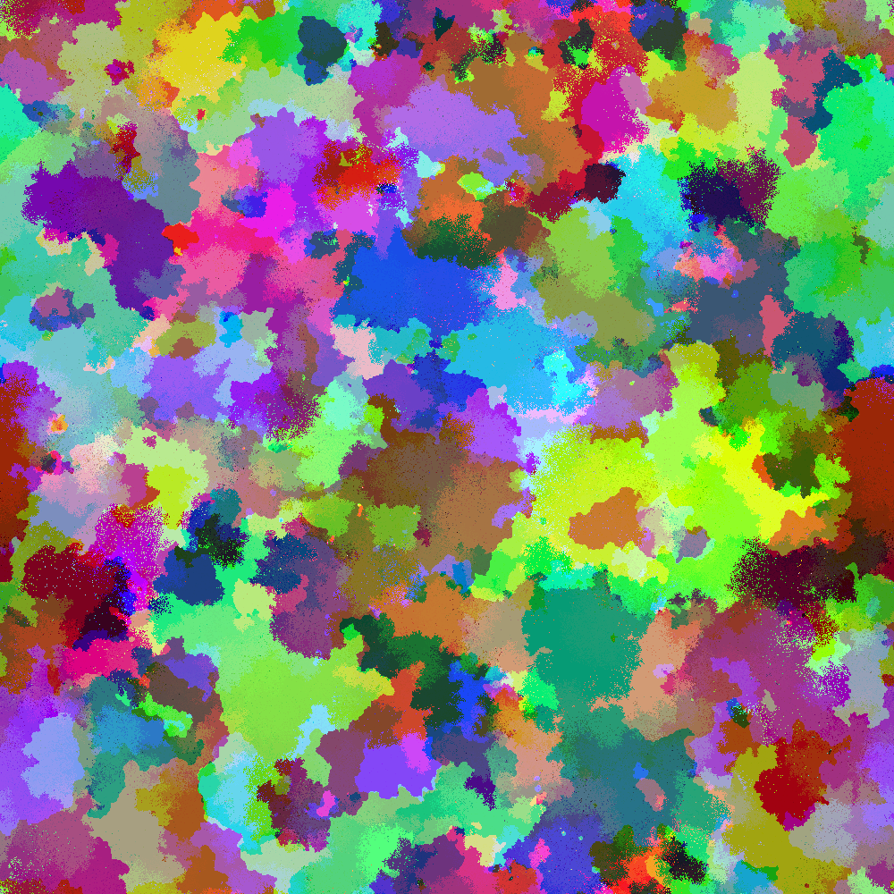

# color-cont

Colors are now considered in a unified fashion, rather than considering red green and blue channels independently.

# Command line options

Put the size parameter as the first argument. Size of resulting (square) image.
